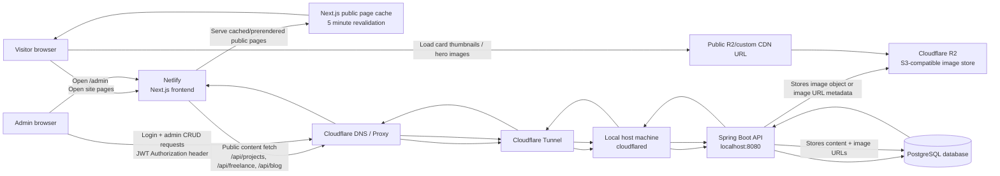

# Architecture

This site uses a hosted frontend, a locally hosted backend exposed through
Cloudflare Tunnel, and Cloudflare R2 for image assets.

For an editable AWS-style architecture diagram, open
[`ARCHITECTURE.drawio`](./ARCHITECTURE.drawio) in diagrams.net/draw.io.



## Request Flow

1. A visitor opens `eduardteodor.co.uk`.
2. Netlify serves the Next.js frontend.
3. Public listing pages are cached/prerendered by Next.js and revalidated every
   5 minutes, so the backend is not hit for every visitor.
4. When public content must be fetched, Netlify calls the API domain.
5. Cloudflare routes that request through Cloudflare Tunnel to the local machine
   running `cloudflared`.
6. The local Spring Boot API handles the request and reads/writes PostgreSQL.
7. Image URLs returned by the API point to Cloudflare R2/public CDN URLs.
8. Browsers download images directly from R2/CDN, not through the Spring Boot API
   or Netlify frontend.

## Admin Flow

1. Admin opens `/admin` on the Netlify frontend.
2. Admin signs in with username/password and TOTP.
3. The frontend stores the final JWT in browser storage.
4. Admin CRUD requests go directly from the browser to the API domain with:

```http
Authorization: Bearer <jwt>
```

5. Cloudflare Tunnel forwards those API requests to the local backend.
6. Backend updates PostgreSQL and stores/returns any R2 image URLs.

## Runtime Responsibilities

- **Netlify**: hosts the Next.js frontend and serves cached/prerendered public
  pages.
- **Next.js**: renders public pages, caches public API-backed pages for 5
  minutes, and streams slower content sections when needed.
- **Cloudflare Tunnel**: exposes the local backend securely without opening a
  public inbound port.
- **Spring Boot API**: owns authentication, admin CRUD, public JSON endpoints,
  and persisted content.
- **PostgreSQL**: stores blog posts, projects, freelance projects, users, and
  image URL metadata.
- **Cloudflare R2**: stores uploaded images and serves them via public/custom CDN
  URLs.
